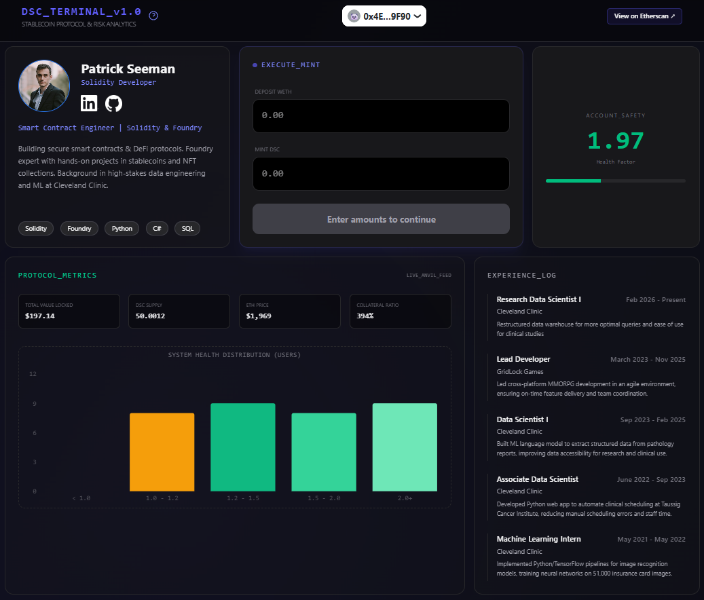

# Web3 Portfolio
This is a portfolio website that doubles as a front end for [my foundry defi stablecoin project](https://github.com/LightPat/foundry-defi-stablecoin)  
[It is hosted at patrickseeman.com ↗](https://patrickseeman.com/)



## Framework

This is a [RainbowKit](https://rainbowkit.com) + [wagmi](https://wagmi.sh) + [Next.js](https://nextjs.org/) project bootstrapped with [`create-rainbowkit`](/packages/create-rainbowkit).

## Getting Started

First, run the development server:

```bash
npm run dev
```

Open [http://localhost:3000](http://localhost:3000) with your browser to see the result.

You can start editing the page by modifying `pages/index.tsx`. The page auto-updates as you edit the file.

## Learn More

To learn more about this stack, take a look at the following resources:

- [RainbowKit Documentation](https://rainbowkit.com) - Learn how to customize your wallet connection flow.
- [wagmi Documentation](https://wagmi.sh) - Learn how to interact with Ethereum.
- [Next.js Documentation](https://nextjs.org/docs) - Learn how to build a Next.js application.

You can check out [the RainbowKit GitHub repository](https://github.com/rainbow-me/rainbowkit) - your feedback and contributions are welcome!